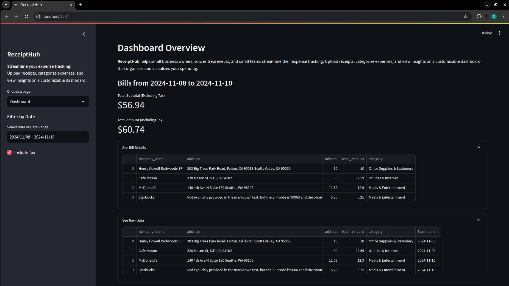
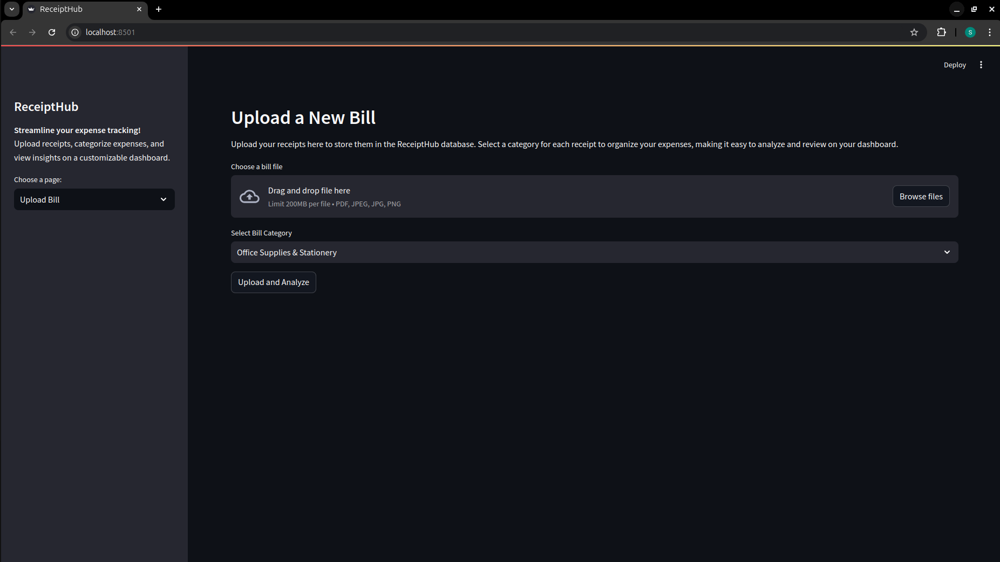

# ReceiptHub

### NVIDIA and LlamaIndex Developer Contest Submission

This repository contains **ReceiptHub**, my submission for the [NVIDIA and LlamaIndex Developer Contest](https://developer.nvidia.com/llamaindex-developer-contest). ReceiptHub is an expense tracking application designed to streamline the receipt management process for small business owners, solo entrepreneurs, and small teams. The application enables users to upload receipts, categorize expenses, and visualize spending insights on a customizable dashboard.

---

## Table of Contents
- [Project Overview](#project-overview)
- [Features](#features)
- [Technology Stack](#technology-stack)
- [Getting Started](#getting-started)
  - [Backend Setup](#backend-setup)
  - [Frontend Setup](#frontend-setup)
- [Usage](#usage)
- [Resources](#resources)


---

## Project Overview

**ReceiptHub** is designed to make expense tracking easy and efficient. The application provides a user-friendly interface where users can:
- Upload receipts in PDF or image format.
- Categorize each expense by selecting a predefined category.
- View detailed insights on a dashboard with a breakdown of expenses, filtered by date and including/excluding tax options.

The dashboard helps users keep a record of their spending, allowing them to see the company name, address, amount, and other relevant details, which enhances accountability and ease of future audits. In the backend, ReceiptHub utilizes LlamaParse to convert uploaded bills into markdown format, which is then processed by the NVIDIA NIM model (mistralai/mixtral-8x22b-instruct-v0.1). This conversion ensures improved accuracy in extracting data from various receipt formats.

---

## Features

- **Upload Receipts**: Allows uploading of receipts as PDFs or images, making it easy to add expenses regardless of format.
- **Categorize Expenses**: Each receipt can be tagged with categories such as "Office Supplies," "Meals & Entertainment," "Travel & Transportation," etc., to organize spending effectively.
- **Visualize Spending**: The dashboard provides a clear view of expenses with options to filter by date range and include/exclude taxes.
- **Detailed Expense Overview**: View detailed information for each bill, including company name, address, category, and amount.
- **Data Persistence**: All the details are saved in an Excel file which can easily be downloaded at any time and all the bills are also stored in the backend in pdf format for future reference and auditing purposes.

---

## Technology Stack

The project leverages powerful AI and web frameworks for optimal functionality:

- **NVIDIA NIM model**: `mistralai/mixtral-8x22b-instruct-v0.1` for enhanced AI capabilities.
- **LlamaParse**: An advanced NLP parser for processing receipts and improving data extraction accuracy.
- **Streamlit**: Frontend framework for building the dashboard interface.
- **Flask**: Backend framework for handling file uploads and managing data storage.

---

## Getting Started

Follow these instructions to set up the project on your local machine.

### Prerequisites

- **Python 3.8 or later**
- **NVIDIA and Llama cloud API keys**

### Clone the Repository

```bash
git clone https://github.com/satyam3196/ReceiptHub.git
cd ReceiptHub
```

### Backend Setup

1. **Navigate to the backend folder**:
   ```bash
   cd backend
   ```

2. **Create a virtual environment** (recommended):
   ```bash
   python3 -m venv myenv
   source myenv/bin/activate  # On Windows, use `myenv\Scripts\activate`
   ```

3. **Install dependencies**:
   ```bash
   pip install -r requirements.txt
   ```

4. **Set up environment variables**:
   Create a `.env` file in the `backend` directory with the following content:
   ```plaintext
   NVIDIA_API_KEY="Your Nvidia API key here"
   LLAMA_CLOUD_API_KEY="Your Llama cloud API key here"
   ```

5. **Run the Flask application**:
   ```bash
   python server.py
   ```
   The backend will start on `http://localhost:5000`.

### Frontend Setup

1. **Open a new terminal** and navigate to the frontend folder:
   ```bash
   cd ../frontend
   ```

2. **Create a virtual environment**:
   ```bash
   python3 -m venv myenv
   source myenv/bin/activate  # On Windows, use `myenv\Scripts\activate`
   ```

3. **Install dependencies**:
   ```bash
   pip install -r requirements.txt
   ```

4. **Run the Streamlit application**:
   ```bash
   streamlit run client.py
   ```
   The frontend will start on `http://localhost:8501`.

---

## Usage

1. **Upload a New Bill**:
   - Go to the **Upload Bill** page.
   - Drag and drop or browse to select your receipt file (PDF, JPEG, JPG, or PNG).
   - Choose a category for the expense (e.g., "Office Supplies & Stationery," "Meals & Entertainment," etc.).
   - The receipt details are saved in the backend database and stored for future reference.

2. **View Dashboard**:
   - Navigate to the **Dashboard** page to view an overview of all uploaded receipts.
   - You can filter by a specific date or date range, toggle tax inclusion, and view details such as company name, address, subtotal, total amount, and category.
   - All data is displayed in a clear, organized format, allowing easy tracking of expenses over time.

---

## Resources

The `resources` section contains various files and folders to demonstrate and test the functionality of ReceiptHub:

- **Upload Bills**: The `upload_bills` folder includes four sample bills in PDF format. These bills can be uploaded to the application to test the bill processing, categorization, and analysis features. For the purpose of development and testing, I have processed over 200 receipts from [Kaggle datasets](https://www.kaggle.com/datasets) with a high level of accuracy. Four samples have been provided here for the user's convenience to test the robustness of the application.

- **Scanned Bills (Sample)**: The `scanned_bills(sample)` folder contains PDF versions of the bills after they have been analyzed by the application. These are saved receipts with categorized data for reference and auditing purposes.

- **Bills Data (Sample)**: The `bills_data(Sample).xlsx` file is an Excel sheet generated after analyzing the uploaded bills. It contains detailed records of each processed receipt, including fields such as `company_name`, `address`, `subtotal`, `total_amount`, `category`, and `scanned_on` date, allowing users to track expenses effectively.

## Screenshots

- **Dashboard Screenshot**:  
    
  Displays the dashboard overview with scanned bills, total amounts, and detailed expense information.

- **Upload Bill Screenshot**:  
    
  Shows the interface for uploading new receipts and selecting expense categories.
---
